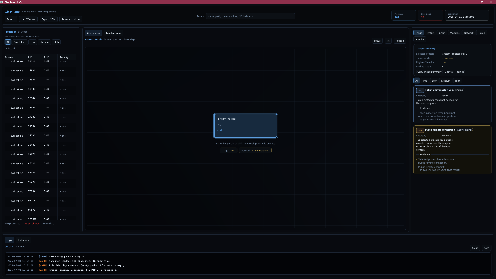
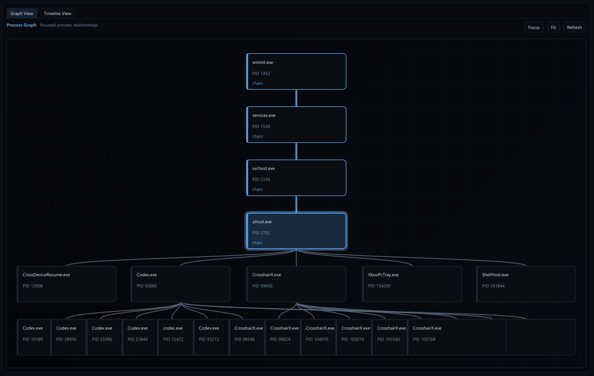
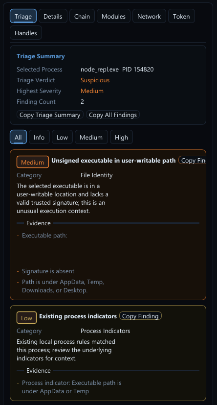
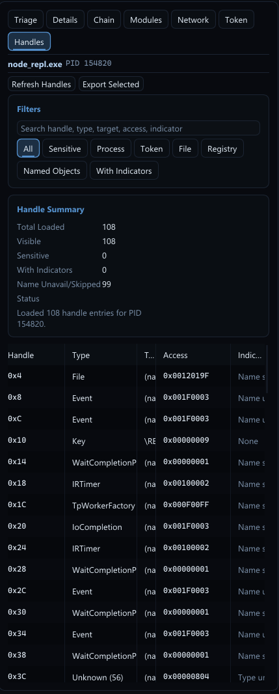

# GlassPane

> **A read-only Windows process relationship and forensic analysis dashboard.**

Current preview: **V0.3.0-PBT**

GlassPane is a modern Windows security analysis tool designed to help analysts, researchers, and developers understand **what a process is doing and why it matters**.

Instead of acting like an antivirus or EDR, GlassPane focuses on **collecting local evidence** and presenting it in a clear, explainable way.

It does **not** upload data, kill processes, inject into processes, or remediate threats.

---

## Features

### Process Analysis

- Process relationship graph
- Parent/child chain visualization
- Timeline view
- Process search and filtering
- Window picker (select a process by clicking its window)

### Triage

- Explainable correlation engine
- Human-readable findings
- Evidence-based severity
- Process chain summaries
- Indicators and contextual notes

### Process Context

- Command line
- Executable path
- SHA256 hashing
- Authenticode signature verification
- File version metadata
- Company / product information

### Modules

- Loaded module inspection
- Module export
- Long-path handling
- Module metadata

### Network

- Process-owned TCP/UDP sockets
- Local / remote endpoints
- Connection ownership
- Network context within findings

### Token Analysis

- User
- SID
- Integrity level
- Elevation state
- Token type
- AppContainer
- Process privileges

### Handle Analysis

- Open handle enumeration
- Object type inspection
- Access rights
- Sensitive handle detection
- Handle filtering and search

### Export

- JSON export
- Markdown selected-process report export
- Structured findings
- Process metadata
- Token information
- Network information
- Handle information

---

# Basis

GlassPane is an analysis tool.

The objective is to help answer questions like:

- Why is this process suspicious?
- What started it?
- What privileges does it have?
- What network connections exist?
- What modules are loaded?
- Is the executable signed?
- Does the evidence warrant investigation?

GlassPane avoids replacing analyst judgment with opaque scoring.

---

# Read-Only Design

GlassPane intentionally does not:

- Inject into processes
- Kill processes
- Suspend processes
- Modify memory
- Close handles
- Duplicate tokens
- Upload files to cloud services
- Perform automatic remediation

GlassPane exists to observe, correlate, and explain.

---

# Screenshots

## Dashboard



## Graph View



## Triage



## Handle Inspection



---

# Building

## Requirements

- Windows 10 / Windows 11
- Visual Studio 2022
- C++17
- DirectX 11

Open the solution in Visual Studio and build:

```
x64
Debug
```

or

```
x64
Release
```

---

# Current Feature Set

- Process graph
- Timeline
- Process search
- Process filtering
- Window picker
- File identity
- Signature verification
- Module inspection
- Network ownership
- Token inspection
- Handle inspection
- Correlation engine
- Triage dashboard
- Exporting results to JSON and Markdown reports

---

# Future

GlassPane will remain focused on analysis.

Future active response capabilities are planned as a **separate project**

---

# Contributing

Issues, feature requests, and pull requests are welcome.

If you discover incorrect findings, false positives, UI issues, or performance regressions, please open an issue with as much detail as possible.

---

# License

MIT License

---

# Disclaimer

GlassPane is intended for security research, incident response, malware analysis, and defensive investigation.

GlassPane should never be treated as a replacement for EDR/Anti-Malware.
